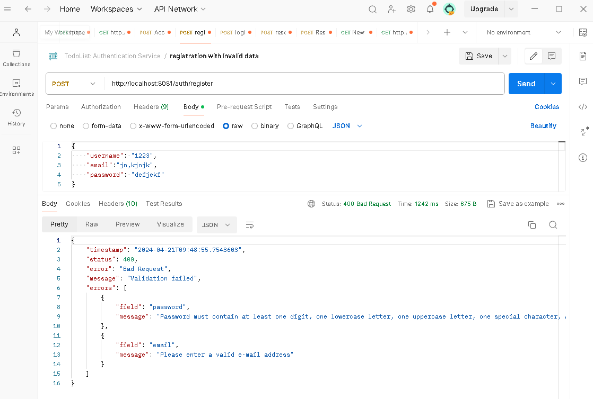
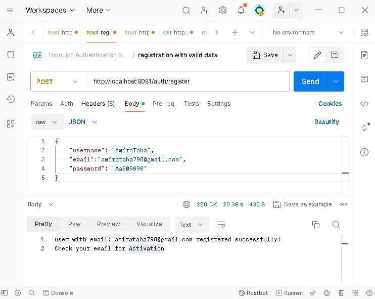
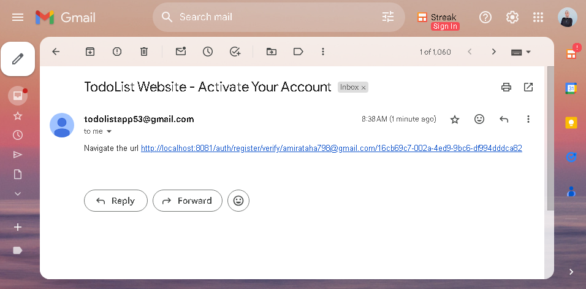

# Todo-List-Microservices
This project follows a  microservices, client-server architectures, consisting of separate services for authentication and managing to-do items, each exposing RESTful APIs.

## Application Architecture
- **discovery-service** - Eureka server
- **api-gateway** - API gateway that proxies all the micro-services
- **authentication-service** - user authentication microservice
- **task-service** - task management microservice
- **web-portal** - client Application that provides the UI

## Microservices Overview
## Authentication Service

**1. Registration Process**
   - User provides email, password, and username.
   - Verification email is sent to the provided email address.
   - User is required to navigate to the verification link included in the email to activate the account.
   - Without activating the account through the provided link, the user cannot log in.

## Demo

## Swagger EndPoints

### web Portal

### Authentication Micro-Service

### Task Micro-Service

## Postman Testing

**1. Registration: invalid data**

**2. Registration: valid data**

**3. Registration: user exists**

**3. Registration: verification email to activate account**

