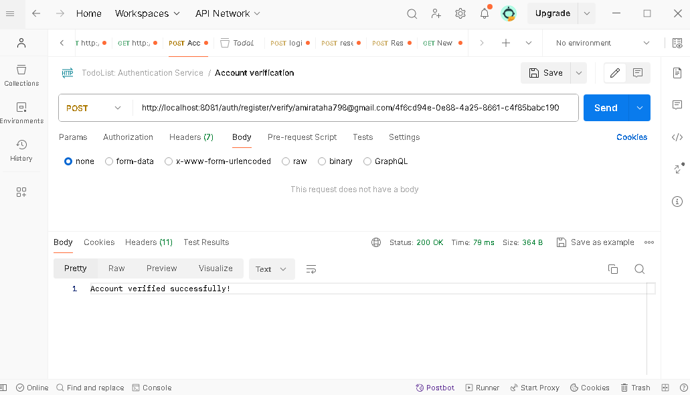
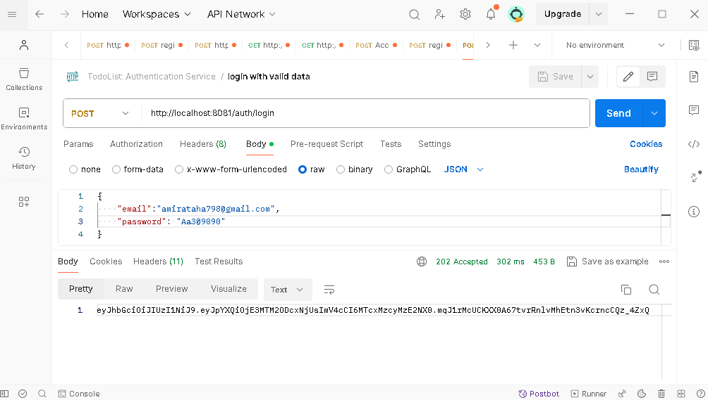
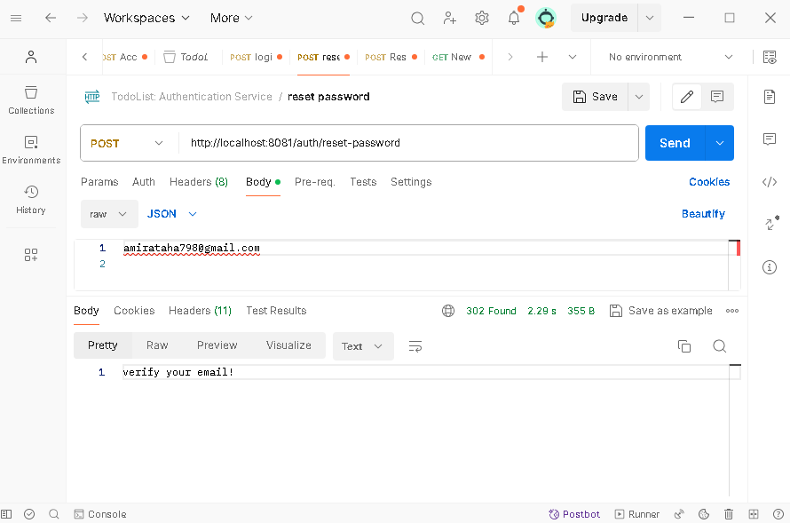
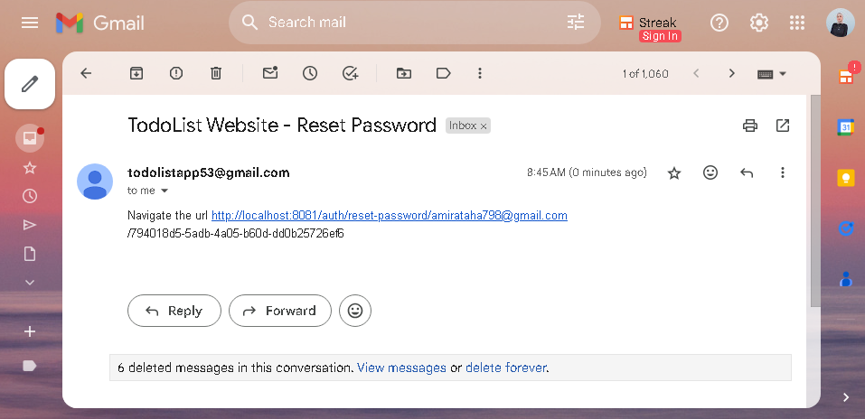
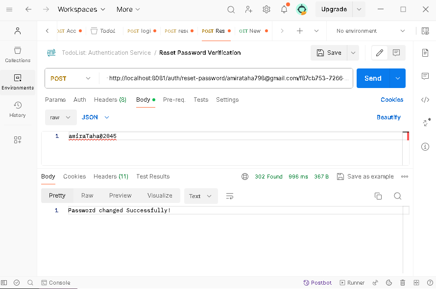

# Todo-List-Microservices
This project follows a  microservices, client-server architectures, consisting of separate services for authentication and managing to-do items, each exposing RESTful APIs.

## Application Architecture
- **discovery-service** - Eureka server
- **api-gateway** - API gateway that proxies all the micro-services
- **authentication-service** - user authentication microservice
- **task-service** - task management microservice
- **web-portal** - Single Page Application that provides the UI

# Microservices Overview
## authentication-service
### Registration
1. **Create Account**

2. **Verify User Email**

3. **Activate Account**

### Authentication

### Change Password
1. **Send Request with Email**

2. **Verify User Email**

3. **Navigate URL and Set New Password**

### **Authentication Service also handle Validation errors and Exceptions**
**Check a sample**

